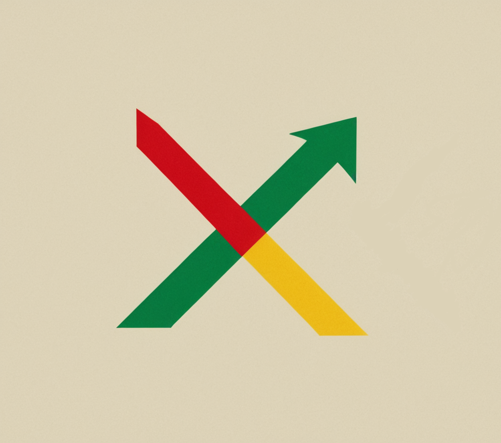

</img>

Синхронизация плейлистов Spotify -> Yandex.Music

Выполните <a target="_blank" href="https://">подготовку</a> и перенесите свой <a target="_blank" href="https://">первый плейлист

 

## Возможности
- Синхронизация выбранного плейлиста
- Синхронизация лайков